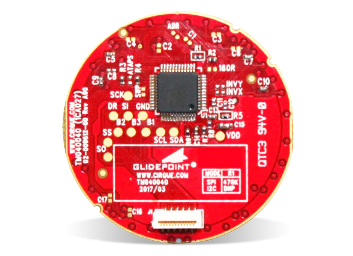

Introduction
============

.. .. image:: https://readthedocs.org/projects/circuitpython-cirque-pinnacle/badge/?version=latest
..     :target: https://circuitpython-cirque-pinnacle.readthedocs.io/en/latest/?badge=latest
..     :alt: Documentation Status

.. .. image:: https://travis-ci.org/2bndy5/CircuitPython_Cirque_Pinnacle.svg?branch=master
..     :target: https://travis-ci.org/2bndy5/CircuitPython_Cirque_Pinnacle
..     :alt: Build Status

A CircuitPython driver library that implements the Adafruit_BusDevice library
for interfacing with the Cirque Pinnacle (1CA027) touch controller used in Cirque Circle Trackpads.

Pinout
========

The above picture is a example of the Cirque GlidePoint circle trackpad. This picture
is chosen as the test pads (larger copper circular pads) are clearly labeled. The test pads
are extended to the 12-pin J1 ribbon cable connector (the white block near the bottom) for which
you should refer to the `datasheet <https://www.mouser.com/pdfdocs/
TM040040_SPI-I2C-PINNTrackpad_SPEC1-21.pdf#page=8>`_ for more detail. The Cirque
circle trackpad models use the following labeling scheme:

``TMyyyxxx-202i-30o``
---------------------
    - ``yyy`` stands for the horizontal width of the trackpad
    - ``xxx`` stands for the vertical width of the trackpad
    - ``i`` stands for the hardwired interface protocol (3 = I2C, 4 = SPI). Notice if there is a
      resistor populated at the R1 (470K ohm) junction (just above the Pinnacle ASIC touch
      controller), it is configured for SPI, otherwise it is configured for I2C.
    - ``o`` stands for the overlay type (0 = none, 1 = adhesive, 2 = flat, 3 = curved)

.. tip:: The SPI protocol is the preferred method for interfacing with more than 1 Cirque circle
    trackpad from the same MCU (microcontroller). The Cirque Pinnacle does not seem to allow
    changing the I2C slave device address; this means only 1 Cirque circle trackpad can be accessed over
    the I2C bus at a time (unless I missed something in the many datasheets provided for this device).

.. note:: Cirque's circle trackpads ship with the non-AG (Advanced Gestures) variant of the Pinnacle
    touch controller ASIC (Application Specific Integrated Circuit). Thus, library focuses on the the non-AG
    variant's functionality via testing, but it does provide access to the AG vaiant's features (though untested).

Dependencies
=============
This driver depends on:

* `Adafruit CircuitPython <https://github.com/adafruit/circuitpython>`_
* `Bus Device <https://github.com/adafruit/Adafruit_CircuitPython_BusDevice>`_

Please ensure all dependencies are available on the CircuitPython filesystem.
This is easily achieved by downloading
`the Adafruit library and driver bundle <https://github.com/adafruit/Adafruit_CircuitPython_Bundle>`_.

How to Install
=====================
This library isn't getting deployed to pypi.org yet. Use the following commands to install this library:

.. code-block:: shell

    git clone https://github.com/2bndy5/CircuitPython_Cirque_Pinnacle.git
    cd CircuitPython_Cirque_Pinnacle
    python3 setup.py install

To install globally, prefix the last command with ``sudo``.

Usage Example
=============

Ensure you've connected the TM0dd0dd-202i-30x correctly by running the simple test located in the `examples folder of this library <https://github.com/2bndy5/CircuitPython_Cirque_Pinnacle/tree/master/examples>`_. See also the `examples/` section.

Contributing
============

Contributions are welcome! Please read our `Code of Conduct
<https://github.com/2bndy5/CircuitPython_Cirque_Pinnacle/blob/master/CODE_OF_CONDUCT.md>`_
before contributing to help this project stay welcoming.

Sphinx documentation
-----------------------

Sphinx is used to build the documentation based on rST files and comments in the code. First,
install dependencies (feel free to reuse the virtual environment from above):

.. code-block:: shell

    python3 -m venv .env
    source .env/bin/activate
    pip install Sphinx sphinx-rtd-theme

Now, once you have the virtual environment activated:

.. code-block:: shell

    cd docs
    sphinx-build -E -W -b html . _build/html

This will output the documentation to ``docs/_build/html``. Open the index.html in your browser to
view them. It will also (due to -W) error out on any warning like Travis will. This is a good way to
locally verify it will pass.
